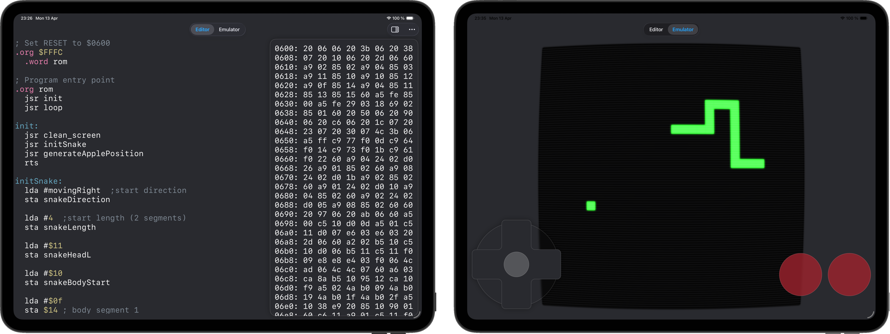

# imaginary 6502

A very basic imaginary computer with imaginary [MOS 6502](https://en.wikipedia.org/wiki/MOS_Technology_6502) in it



**List of contents:**
* [i6502App](#i6502App) - iPhone, iPad and MacOS standalone app based on core package
* [i6502Core](#i6502Core) - Assembly & Emulator SPM package

## i6502Core
### Assembler

Implements a tiny subset of [ca65](https://cc65.github.io/doc/ca65.html) assembler. All code is treated as case-insensitive (might be changed later). Internally process is split onto 3 phases: tokenizing, linking and translation and covered by corresponding [tests](/i6502Core/Tests/)

End goal was never to build a large scale IDE so probably no multi-files, C-lang macros, LLDB intermediate representation and other cool translator-nerdy stuff

<details>
  <summary>Assembler programming reference</summary>

#### Operations
All [56 legal opcodes](https://www.6502.org/tutorials/6502opcodes.html) with their addressing modes. Illegal ones (like LAX) are not supported but can be placed with `.byte`

#### .define
`.define YYYY $XXXX` binds YYYY name to $XXXX literal. Supports only name-to-constant binding

#### .org
`.org $XXXX` sets $XXXX as address for next instruction. May be used as a "raw" variant of `.section` since it is not supported

#### .byte & .word
`.byte $XX` places raw byte at current instruction address. Accepts decimal and hexadecimal values (even negative for 2's complement) in appropriate range

`.word $XXXX` places raw word (two bytes) in little-endian into current instruction address. Accepts decimal and hexadecimal values (non-negative) in appropriate range

#### Comments
Line comments start at ';' till EOL

#### Labels
`YYYY:` sets a label to current instruction address. Supports both forward (declaration-after-use) and backward declaration (declaration-before-use). Resolved at linking stage to an actual memory address and can be used in all absolute, relative and indirect operations

```asm
routine_ref: .word $1000
; ...
jmp (routine_ref) ; will be resolved to address $1000
```


</details>

#### Worth mentioning

* Hexadecimal leading zeroes force absolute mode: `adc $10` vs `adc $0010`

* For debug purposes i6502Core package has "Main" i6502CLI target that spits compiled hexdump result for given file input


### Emulator

6502 state machine interpreter / emulator

Currently implemented an instruction-accurate emulation (all read-write-page_cross actions happen in one cpu cycle, then execution idles N-1 cycles)

All memory and registers are filled with random bytes upon initialization, reset and interrupts are properly emulated by routing execution to according addresses at $FFFA-$FFFF

<details>
  <summary>How to use?</summary>

```Swift
// get 64KiB memory image from assembler
let memory: [UInt8?] = try Assembler.compileBytes(input: "...")

// initailize emulator
var emulator = Emulator(
    memory: memory,
    devices: [...]
)

// signal RESET to cpu
emulator.reset()
while true {
    emulator.cycle()
}
```

</details>

<details>
  <summary>Interrupt mapper in assembly</summary>

```asm
; Memory map
.define NMI    $1000
.define RESET  $2000
.define IRQ    $3000

; Bind interrupt handlers
.org $FFFA
    .word NMI    ; $FFFA-$FFFB: NMI handler address
    .word RESET  ; $FFFC-$FFFD: RESET (program entry point) handler address
    .word IRQ    ; $FFFE-$FFFF: IRQ/brk handler address

.org RESET
    ; your program here
```

</details>


## i6502App

i6502 app is featuring a live-reload 6502 assembly editor optimized for iPad and MacOS:


### Editor tab features:
* Dismissable hexdump inspector
* Syntax highlight
* Font size control
* Light and dark themes

### Emulator tab features:
* Tiny monochrome CRT 32x32 monitor
* DPAD and RESET buttons

### TBD:
* Illegal opcode execution
* Clock speed control (1Hz ... 1GHz)

## Useful links

* [Easy 6502](https://skilldrick.github.io/easy6502/) - smooth and short introduction to 6502 plus VERY useful playground
* [6502.org](https://www.6502.org/tutorials/6502opcodes.html) - table of official operation codes with comprehensive description
* [obelisk.me.uk](https://web.archive.org/web/20210626024532/http://www.obelisk.me.uk/6502/registers.html) - brief description of 6502 CPU registers
* [emulationonline.com](https://www.emulationonline.com/systems/nes/) - series of articles about NES emulation that based on 6502 architecture
* [nesdev.org](https://www.nesdev.org/wiki/NES_reference_guide) - NES-related wiki 
